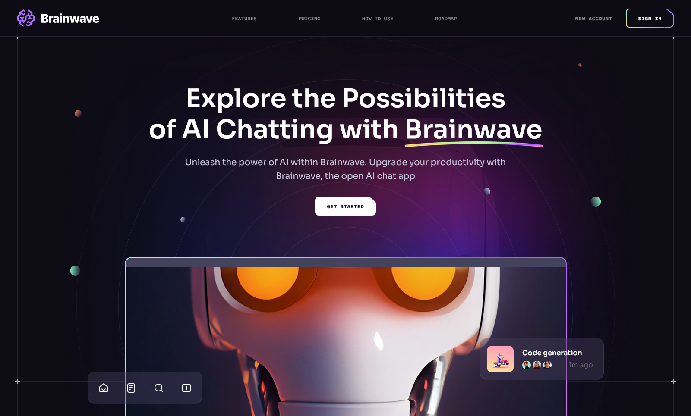

# Brainwave

Brainwave is a demo website for an AI company, showcasing their offerings and pricing models and their plans for future. It was built using React.js. [Live Demo](https://brainwave-dutta.netlify.app/)

## Tech Stack

- **React.js**: JavaScript library for building user interfaces.
- **Tailwind CSS**: Utility-first CSS framework for creating modern designs without writing custom CSS.
- **Vite**: Frontend build tool that provides a fast development server and optimized build process.

## Learnings

- **Vite Starter Files**: Utilized Vite to set up the React app starter files.
- **Tailwind CSS**: Learned how to use Tailwind CSS to build modern websites without the need to write custom CSS. Explored creating custom classes by defining a custom theme for Tailwind CSS.
- **React Router**: Employed React Router to create single-page applications (SPAs).
- **React Just Parallax**: Integrated the "React Just Parallax" library to implement mouse scroll and mouse hover parallax effects on the website.
- **Component Architecture**: Implemented a component architecture that focused on reusability, encapsulating each component's render logic and state, and minimizing prop drilling. Paid serious attention to file and component architecture.

## Credits

The design of the website is credited to [ui8](https://ui8.net/).
